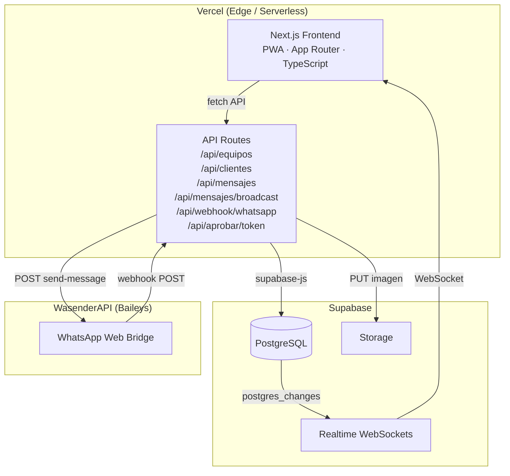
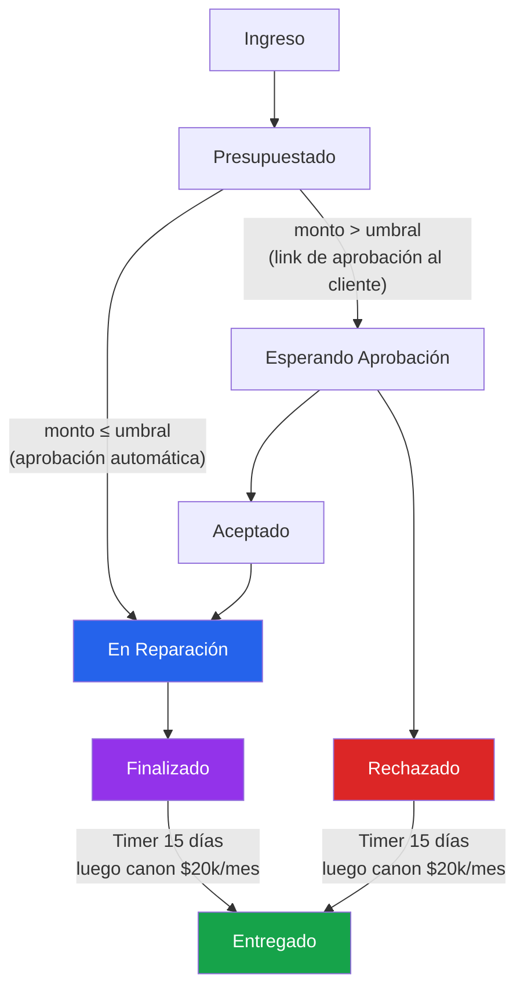

# Sistema de Gestión para Taller de Motoimplementos
## Documento Técnico — Arquitectura, Problemas y Soluciones

---

## 1. Descripción del Proyecto

Sistema SaaS privado desarrollado para un taller de reparaciones de motoimplementos (motosierras, motoguadañas, grupos electrógenos). El sistema digitaliza y automatiza el flujo completo de trabajo: desde el ingreso de un equipo, pasando por el diagnóstico y presupuesto, hasta la entrega final al cliente — con notificaciones automáticas vía WhatsApp, aprobaciones online y sincronización en tiempo real entre dispositivos.

---

## 2. Stack Tecnológico

| Capa | Tecnología | Justificación |
|------|-----------|---------------|
| Frontend | Next.js 14 (App Router) + TypeScript | SSR/SSG, routing basado en archivos, RSC para páginas pesadas |
| Estilos | Tailwind CSS | Utility-first, mobile-first sin overhead de CSS extra |
| Base de datos | Supabase (PostgreSQL) | Realtime via WebSockets, RLS por fila, Auth incluido |
| Storage | Supabase Storage | Almacenamiento de archivos con URLs públicas directas |
| Backend | Next.js API Routes (serverless) | Sin servidor dedicado, deploy automático con el frontend |
| Deployment | Vercel | CI/CD automático desde Git, edge network, logs en tiempo real |
| WhatsApp | WasenderAPI (Baileys) | API HTTP sobre librería open source de WhatsApp Web |
| PWA | next-pwa / service workers | Instalable en mobile, funciona sin conexión parcialmente |
| Notificaciones Push | Web Push API | Alertas nativas en dispositivos sin necesidad de app nativa |

---

## 3. Arquitectura General



### Flujo de datos en tiempo real

Supabase Realtime usa WebSockets. Cada cliente conectado suscribe a cambios en las tablas relevantes. Cuando el técnico actualiza un estado desde su celular, los demás dispositivos (PC del dueño, tablet) reciben el cambio en menos de 300ms sin polling.

```typescript
const channel = supabase
  .channel('equipos-realtime')
  .on('postgres_changes', { event: '*', schema: 'public', table: 'equipos' }, handler)
  .subscribe()
```

---

## 4. Modelo de Datos y State Machine

El núcleo del sistema es una máquina de estados estricta sobre el campo `estado_actual` de la tabla `equipos`. Las transiciones son irreversibles y controladas exclusivamente por el servidor.



**Umbral de aprobación configurable:** el monto a partir del cual se requiere aprobación explícita del cliente (inicialmente $100.000) es un parámetro de entorno `NEXT_PUBLIC_MONTO_UMBRAL_APROBACION`, no un valor hardcodeado. El dueño del taller puede ajustarlo sin necesidad de modificar código ni hacer un nuevo deploy — un detalle crítico en un contexto inflacionario donde $100.000 puede representar hoy un service básico y mañana ni el diagnóstico.

```typescript
// src/lib/state-machine.ts
const MONTO_APROBACION = parseInt(
  process.env.NEXT_PUBLIC_MONTO_UMBRAL_APROBACION || '100000', 10
)
```

**Política de guarda:** tanto en estado `Rechazado` como en `Finalizado`, si el cliente no retira el equipo en 15 días corridos, se acumula un canon de guarda calculado en tiempo real comparando `fecha_evento` con `Date.now()`. A los 6 meses el equipo pasa a propiedad del taller.

**Regla de negocio crítica:** si el monto supera el umbral, el sistema genera un `token_aprobacion` UUID único, lo guarda en la DB y envía al cliente un link del tipo `/aprobar/[token]`. Desde esa página pública el cliente acepta o rechaza sin necesidad de cuenta ni login.

---

## 5. Sistema de Autenticación

La app es un sistema privado para el taller, no para usuarios externos. Se implementó autenticación por código compartido en lugar de usuarios individuales:

- Página `/acceso` pide un código PIN configurado via variable de entorno
- Si es correcto, el servidor firma una cookie `HttpOnly; Secure; SameSite=Strict` con duración de 30 días
- El middleware de Next.js (`middleware.ts`) verifica la cookie en cada request a rutas protegidas
- Rutas públicas: `/aprobar/[token]` (para clientes), `/acceso`, assets estáticos

---

## 6. Integración con WhatsApp (WasenderAPI)

### 6.1 Arquitectura del canal WhatsApp

WasenderAPI actúa como bridge HTTP sobre una sesión de WhatsApp Web. La app interactúa de dos formas:

**Outbound (envío):** POST a `https://www.wasenderapi.com/api/send-message` con `Authorization: Bearer [key]` y payload `{ to: "549...@s.whatsapp.net", text: "..." }` o `{ to, imageUrl: "https://..." }`.

**Inbound (recepción):** WasenderAPI hace POST al webhook `/api/webhook/whatsapp` cada vez que llega un mensaje o cambia el estado de uno enviado.

### 6.2 Eventos del webhook

```typescript
// messages.received  → mensaje entrante de un cliente
// message.sent       → confirmación de entrega de un mensaje nuestro
```

### 6.3 Normalización de números argentinos

WhatsApp en Argentina usa el formato `549XXXXXXXXXX` (país 54 + prefijo 9 + 10 dígitos = 13 dígitos). Los usuarios a veces ingresan el número con `+`, con el `15` local, con código de área de 3 o 4 dígitos, etc. Se implementó una función `normalizarTelefono()` que canonicaliza cualquier formato de entrada al formato estándar antes de guardarlo o enviarlo.

---

## 7. Problemas Técnicos Encontrados y Soluciones

### 7.1 El problema del LID de WhatsApp

**Problema:** WhatsApp migró progresivamente su infraestructura interna de identificadores. En lugar de usar el número de teléfono como JID (identificador de conversación), comenzó a usar un ID interno llamado LID con formato `@lid`. Esto afecta a **todos los usuarios**, no solo a WhatsApp Business.

Cuando un cliente enviaba un mensaje, el webhook recibía `remoteJid: "84723947283947@lid"` en lugar de `"5491136450985@s.whatsapp.net"`. Al intentar guardar ese número en la DB, la conversación quedaba sin vincular al cliente real y el número era irreconocible.

**Diagnóstico:** Se agregó logging exhaustivo del payload completo del webhook. Se descubrió que el objeto `key` del mensaje incluía los campos `cleanedSenderPn` y `senderPn` con el número de teléfono real, aunque el `remoteJid` sea un LID.

**Solución implementada:**
```typescript
// En messages.received:
const esLid = remoteJid?.endsWith('@lid')
if (esLid || !esNumeroValido(numeroWa)) {
  const senderPn = msg.key?.cleanedSenderPn || msg.key?.senderPn
  if (senderPn) {
    numeroWa = normalizarTelefono(senderPn.toString().split('@')[0])
  }
}
```

**Auto-captura del LID:** Para poder enviar mensajes de vuelta a un cliente que originalmente contactó por LID, necesitamos saber su LID (ya que WasenderAPI puede entregar a `@lid` en lugar del número). Se implementó captura automática via el evento `message.sent`: cuando WasenderAPI confirma entrega a un `@lid`, el sistema busca a qué cliente corresponde ese mensaje y guarda el LID en `clientes.whatsapp_lid`.

La búsqueda se hace con tres intentos en cascada:
1. Por `whatsapp_id` exacto (key.id del evento vs whatsapp_id guardado en mensajes)
2. Por `body.data.id` (ID alternativo que expone WasenderAPI en el payload del evento)
3. Por recencia: si en los últimos 90 segundos solo se envió a un único cliente, ese es el correcto

**Limitación conocida del intento 3 (recencia):** Si el operador del taller está chateando en paralelo con dos clientes distintos en la misma ventana de 90 segundos, el paso 3 encuentra ambiguedad, registra `"X clientes recientes, ambiguo"` en el log y **no asigna el LID a ninguno** — falla de forma segura, sin asignación incorrecta. El LID simplemente no queda capturado en ese intento y se capturará en la próxima interacción cuando haya un contexto menos ambiguo.

La confiabilidad real del sistema descansa en los pasos 1 y 2: durante el debugging se encontró que `key.id` del evento `message.sent` no siempre coincide con el `msgId` de la respuesta de WasenderAPI, por lo que el paso 2 existe como fallback. Para usos de un solo operador con tráfico bajo (el caso real de este taller), el sistema funciona correctamente en la práctica.

Una vez capturado el LID, todos los mensajes previos con ese LID como `numero_wa` se migran al número real del cliente, unificando la conversación.

---

### 7.2 Broadcast de imágenes: WasenderAPI rechaza base64

**Problema:** Al implementar la campaña de mensajes con imagen, se enviaba la imagen como `data:image/jpeg;base64,...` en el campo `image`. WasenderAPI devolvía:
```json
{ "message": "The text field is required when none of image url / video url are present" }
```
El campo `image` con base64 era ignorado completamente.

**Diagnóstico:** Los logs de Vercel mostraron el status 422 con el cuerpo exacto del error. WasenderAPI solo acepta URLs públicas, no base64.

**Solución:** Subir la imagen a Supabase Storage antes del loop de envío y usar la URL pública:
```typescript
const { error } = await supabase.storage
  .from('broadcast-temp')
  .upload(fileName, buffer, { contentType: imagenMime })

const { data } = supabase.storage.from('broadcast-temp').getPublicUrl(fileName)
// Usar data.publicUrl como imageUrl en WasenderAPI
```

---

### 7.3 WasenderAPI procesa imágenes de forma asíncrona

**Problema:** Después de implementar la solución anterior, la imagen llegaba con status 200 pero WasenderAPI reportaba error al descargarla (`400 while downloading the media file`).

**Causa:** WasenderAPI devuelve `{"status":"in_progress"}` inmediatamente — el 200 es un ACK, no una confirmación de descarga. El archivo fue eliminado de Storage antes de que WasenderAPI lo descargara.

**Solución:** No borrar el archivo en el route. El archivo queda en Storage hasta que WasenderAPI lo procese. El bucket `broadcast-temp` acumula archivos sin impacto significativo en costo para el volumen del negocio.

---

### 7.4 Rate limiting entre imagen y texto (Account Protection)

**Problema:** Al enviar imagen y texto como dos mensajes separados, el segundo mensaje devolvía:
```json
{ "message": "You can only send 1 message every 5 seconds. Account protection enabled.", "retry_after": 4 }
```

**Primer intento fallido — delay fijo:** Se aumentó el delay a 5.5 segundos. Seguía fallando. La causa raíz es que WasenderAPI procesa los mensajes de forma **asíncrona**: devuelve 200 inmediatamente (`status: "in_progress"`) pero recién intenta enviar la imagen segundos después. Su ventana de 5 segundos empieza cuando *ellos* procesan el mensaje, no cuando nosotros recibimos el 200. Un delay fijo de nuestra parte nunca puede ganarle a un procesamiento asíncrono de tiempo variable.

**Solución definitiva — retry con backoff del servidor:** En lugar de adivinar cuánto esperar, se implementó una función `wasenderPost` que reintenta automáticamente si recibe un 429, usando el campo `retry_after` que la propia API devuelve en la respuesta:

```typescript
async function wasenderPost(apiKey: string, body: object, intento = 1) {
  const res = await fetch('https://www.wasenderapi.com/api/send-message', { ... })
  const text = await res.text()
  if (res.status === 429 && intento <= 3) {
    const retryAfter = (JSON.parse(text)?.retry_after ?? 5) + 1
    await delay(retryAfter * 1000)
    return wasenderPost(apiKey, body, intento + 1)  // reintenta solo este mensaje
  }
  return { ok: res.ok, text, msgId: ... }
}
```

Si la imagen ya se envió correctamente, no se retoca — el retry aplica únicamente a la llamada que recibió el 429. Si no hay imagen, el texto se envía directo sin ningún delay.

**Nota:** WasenderAPI permite desactivar "Account Protection" desde la configuración de la sesión, lo que eliminaría el rate limit por completo.

---

### 7.5 Mensajes duplicados por el webhook

**Problema:** El webhook `messages.received` captura también los mensajes enviados por nosotros (`fromMe: true`). El broadcast guardaba un registro en la DB, pero el webhook insertaba otro por el mismo mensaje. Resultado: cada mensaje aparecía dos veces, una con el contenido correcto y otra con la URL de Supabase como texto plano.

**Solución:** Extraer el `msgId` de la respuesta de WasenderAPI y guardarlo como `whatsapp_id` en cada insert del broadcast:
```typescript
const msgId = JSON.parse(resBody)?.data?.msgId?.toString() || null
await supabase.from('mensajes').insert({ whatsapp_id: msgId, ... })
```
El webhook ya tenía lógica de dedup: si encuentra un registro con el mismo `whatsapp_id`, descarta el mensaje sin duplicarlo.

---

### 7.6 Layout del chat en mobile (PWA)

**Problema:** En mobile, el panel de mensajes no ocupaba el alto correcto. `100vh` en mobile browsers incluye la barra del navegador, que aparece y desaparece al hacer scroll. El resultado era un gap entre el chat y la navbar inferior, o contenido cortado.

**Primer intento fallido:** `h-[calc(100dvh-5rem)]` — rompía el layout en algunos browsers por soporte inconsistente de `100dvh`.

**Solución definitiva:** `position: fixed` con `inset` explícito:
```jsx
<div className="fixed inset-x-0 top-0 bottom-[5rem] sm:static sm:h-[calc(100vh-3.5rem)]">
```
En mobile: fixed desde el top hasta 5rem del fondo (donde vive la navbar). En desktop: vuelve al flujo normal. Además se bloquea el scroll del `body` cuando hay un chat abierto para evitar scroll fantasma detrás del panel.

---

### 7.7 Mensajes largos rompían el layout del chat

**Problema:** Mensajes con URLs largas o texto continuo sin espacios expandían el bubble horizontalmente más allá del viewport, empujando el input de envío fuera de la pantalla.

**Causa raíz:** En Flexbox, los items tienen `min-width: auto` por defecto, lo que les permite crecer más allá de `max-width`. El `max-w-[80%]` del bubble no alcanzaba porque el flex container padre no tenía `min-w-0`.

**Solución:**
```jsx
// Contenedor scroll: overflow-x-hidden para que no expanda el viewport
<div className="flex-1 overflow-y-auto overflow-x-hidden ...">

// Cada row y bubble: min-w-0 para que respeten el max-width
<div className="flex min-w-0 ...">
  <div className="max-w-[80%] min-w-0 ...">
    {/* break-all para URLs sin espacios */}
    <p className="whitespace-pre-wrap break-all">{contenido}</p>
```

---

### 7.8 Migración de proveedor WhatsApp: Z-API → WasenderAPI

El proyecto originalmente usó Z-API como proveedor de WhatsApp. Se encontraron inconsistencias en el formato del webhook y el comportamiento del JID. La migración a WasenderAPI implicó cambios no triviales:

- **Formato del JID:** Z-API aceptaba el número directamente; WasenderAPI requiere `numero@s.whatsapp.net`
- **Campo del mensaje:** Z-API usaba `message`; WasenderAPI usa `text`
- **Redirect y headers:** WasenderAPI redirige HTTP → HTTPS y los redirects de `fetch` no preservan el header `Authorization`. Solución: apuntar directamente a `https://www.wasenderapi.com` sin redirect
- **Rate limiting:** Se agregó `delay(2000)` entre mensajes del presupuesto y `delay(1200)` entre destinatarios del broadcast

---

### 7.9 Estado "no leído" no se actualizaba al abrir el chat

**Problema:** El badge de mensajes no leídos en la lista de conversaciones persistía después de abrir el chat. Solo desaparecía al volver a la lista.

**Causa:** La API marcaba los mensajes como leídos en la DB al abrirlos, pero el estado local `conversaciones` solo se recargaba con un evento `INSERT` via Realtime. Un `UPDATE` de `leido: false → true` no disparaba el listener.

**Solución:** Optimistic update en el cliente: cuando el usuario selecciona una conversación, se pone a cero `no_leidos` en el estado local inmediatamente.

```typescript
const handleSeleccionar = (numero: string) => {
  setSeleccionada(numero)
  setConversaciones(prev => prev.map(c =>
    c.numero_wa === numero ? { ...c, no_leidos: 0 } : c
  ))
}
```

---

## 8. PWA e Instalación en Mobile

La app está configurada como Progressive Web App. El técnico del taller trabaja con el celular en la mano. Los requisitos de UX fueron botones grandes (mínimo 44×44px táctil), acciones rápidas sin scroll e instalable como app nativa.

Las notificaciones push usan la Web Push API con VAPID keys. Cada dispositivo que abre la app se registra en la tabla `push_subscriptions`. Cuando llega un mensaje de WhatsApp, el webhook itera sobre todas las suscripciones activas y envía la notificación.

---

## 9. Decisiones de Arquitectura Relevantes

**¿Por qué no una app móvil nativa?**
El cliente no tiene presupuesto para publicar en Play Store / App Store ni para mantener dos codebases. PWA cubre el 90% del caso de uso con una sola codebase.

**¿Por qué serverless en lugar de un servidor dedicado?**
El sistema tiene tráfico muy bajo y esporádico. Serverless en Vercel elimina costo fijo de servidor. La única limitación real es el timeout de 300s en funciones, que impone un techo en el broadcast (ver sección 10).

**¿Por qué Supabase en lugar de otro backend?**
Realtime out-of-the-box sin configurar websockets propios, Storage con URLs públicas para las imágenes de broadcast, y el service role key bypasea RLS desde las API routes sin necesidad de lógica de autorización compleja.

**¿Por qué lógica de negocio en el servidor y no en la DB?**
Para las reglas de la state machine se optó por validaciones en las API routes antes que triggers en PostgreSQL. Esto facilita el debugging (los logs de Vercel muestran exactamente qué pasó) y permite mensajes de error descriptivos.

---

## 10. Métricas y Limitaciones Conocidas

- **Tiempo de respuesta del webhook:** < 500ms desde que llega el mensaje hasta que aparece en el chat
- **Latencia del Realtime:** < 300ms entre un cambio de estado y la actualización en otro dispositivo
- **Costo operativo mensual estimado:** < USD 30 (Vercel Pro + Supabase Free + WasenderAPI)

**Límite del broadcast en Vercel (techo real):**

El broadcast corre dentro de una API Route con `maxDuration = 300s`. El techo efectivo de destinatarios depende del tipo de envío:

| Tipo de envío | Delay por destinatario | Máx. destinatarios en 300s |
|---|---|---|
| Solo texto | ~1.2s | ~250 |
| Imagen + texto | ~6.7s (5.5s + 1.2s) | ~44 |

Para escalar más allá de estos umbrales, la arquitectura correcta es sacar el loop del ciclo request/response: encolar los envíos en **Upstash QStash** (cola HTTP serverless) o usar **Vercel Background Jobs**, procesando lotes de 10-20 destinatarios por invocación independiente. Esto desacopla completamente el tiempo de respuesta al usuario del tiempo total de la campaña.

---

## 11. Futuras Mejoras

- **Broadcast a escala:** Reemplazar el loop síncrono en la API Route por una cola de mensajes (Upstash QStash / Vercel Background Jobs) para soportar cientos o miles de destinatarios sin depender del timeout de la función
- **Panel de analytics:** Tasa de reparaciones por estado, tiempo promedio por fase, monto total facturado por período
- **Multi-técnico:** Actualmente el sistema no tiene usuarios diferenciados; agregar roles (dueño vs. técnico) con Supabase Auth
- **Backup automático:** Export periódico de la DB a un bucket de Storage como JSON o CSV

---